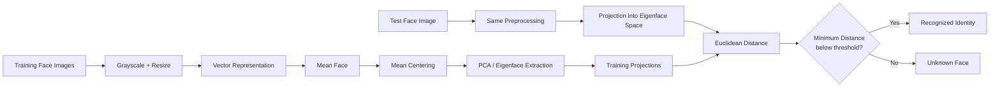
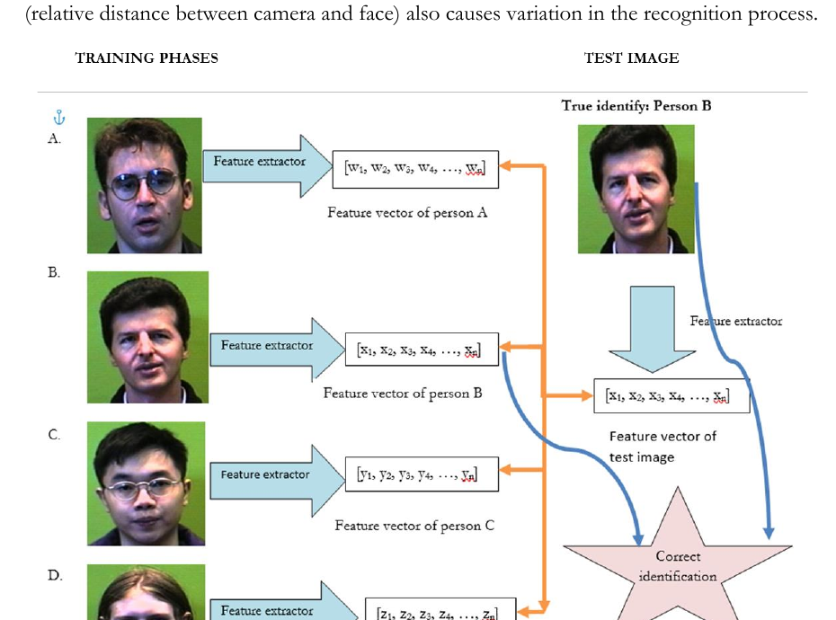

# Face Recognition System: 2014 MATLAB Project → 2026 Python Reproduction

A small piece of computing history, preserved and rebuilt.

This repository contains two implementations of the same Bachelor's final-year project:

- **MATLAB**: a cleaned, faithful reproduction of the original project developed in 2014.
- **Python**: a modern 2026 reproduction that keeps the original PCA/Eigenface idea but improves the software architecture, reproducibility, evaluation, persistence, and user experience.

The original project was titled **Face Recognition System Using MATLAB** and was submitted as a B.Tech final-year project in Computer Science and Engineering at Jalpaiguri Government Engineering College in March 2014.

That context matters. The original work is now more than twelve years old. It should not be read as a contemporary state-of-the-art face-recognition system. Its value today is different: it is a compact, understandable example of how classical computer vision and statistical learning were used in an undergraduate project before deep face embeddings and modern vision foundation models became standard.

---

## Why this repository exists

The original project implemented face recognition using:

1. grayscale image preprocessing,
2. Principal Component Analysis (PCA),
3. the Eigenface representation,
4. projection into a lower-dimensional face space, and
5. Euclidean-distance matching against a training set.

The report also discusses practical sources of variation such as facial expression, illumination, pose, scale, glasses, facial hair and other appearance changes.

The original MATLAB code was written for **MATLAB 2011a**. The report contains the implementation, screenshots, mathematical derivation and a schematic of the recognition workflow.

The purpose of this repository is therefore twofold:

> **Preserve the original project as faithfully as practical, while also showing how the same classical idea can be engineered using a modern Python stack in 2026.**

The Python implementation is explicitly a reproduction and modernization. It is **not** presented as the code that existed in 2014.

---

## Historical context

The original report is dated **10 March 2014**. At that point, PCA/Eigenfaces were an established and highly teachable classical approach to face recognition. The project focused on understanding the mathematics and implementing the complete pipeline in MATLAB rather than using a pretrained deep neural network.

The report describes a training set of 100 images covering ten people, with variation in expressions, illumination, rotation and scale. The implementation normalized input images to 250×250 grayscale images before extracting PCA features.

The project also included a MATLAB interaction flow using directory-selection dialogs, an image-number dialog, and MATLAB figure windows for displaying the query and matched images.

Today, this approach is deliberately simple compared with modern face-recognition systems. That simplicity is part of the point of keeping it.

---

## Dataset used for reproduction

The report describes the original training set but does not contain the original 100 image files. To make the project reproducible, this repository uses a **public pre-2014 face dataset** as a documented substitute: the **AT&T Database of Faces, formerly the ORL Database of Faces**.

The dataset was collected between April 1992 and April 1994. It contains 40 subjects with ten images per subject, with variations in lighting, facial expression and facial details such as glasses. Images are grayscale PGM files of 92×112 pixels.

For this project, the reproducibility configuration selects:

- subjects `s1` through `s10`
- images `1.pgm` through `10.pgm`
- 10 subjects × 10 images = **100 images**
- the images are subsequently normalized to 250×250 for the recognition pipeline

Official dataset page:

https://cam-orl.co.uk/facedatabase.html

**Important:** the ORL/AT&T images are a reproducibility substitute. This repository does not claim that they were the images used in the original 2014 project.

The dataset itself is **not redistributed in this repository**. Users should obtain it from the official source and follow its attribution requirements.

---

## Conceptual architecture

The core recognition architecture is the same idea described in the original report:



### What the diagram means

During training, the system learns a low-dimensional representation of the faces in the dataset. PCA identifies directions of maximum variation. These directions are represented visually as **Eigenfaces**.

A query image is transformed using exactly the same preprocessing and projected into the learned face space. Recognition becomes a nearest-neighbour problem in that lower-dimensional space.

The original report describes the recognition decision using Euclidean distance and a threshold for rejecting images that are too far from the known training faces.

---

## The original architecture from the 2014 report

The report contains its own schematic of the recognition system. It shows several known people passing through a feature-extraction stage, producing feature vectors, while a test image follows the same feature-extraction path and is compared against the stored representations.



The diagram above is preserved here as historical documentation. The modern repository architecture is conceptually the same, but the implementations have been separated into a faithful MATLAB branch and a modern Python branch.

---

## Mathematical foundation

Let the training images be represented by vectors:

\[
\Gamma_1, \Gamma_2, \ldots, \Gamma_m
\]

The mean face is:

\[
\Psi = \frac{1}{m}\sum_{i=1}^{m}\Gamma_i
\]

Each image is mean-centered:

\[
\Phi_i = \Gamma_i - \Psi
\]

The centered training vectors form a matrix. PCA is then used to identify the principal directions of variation. These directions become the Eigenfaces.

A face can then be represented by its coordinates in the Eigenface space:

\[
\Omega = U^T(\Gamma - \Psi)
\]

where `U` contains the selected Eigenfaces.

For a test image, the system compares its projected representation with the stored projections using Euclidean distance:

\[
d_i = \|\Omega - \Omega_i\|_2
\]

The closest known representation becomes the candidate identity. A rejection threshold can be used to classify sufficiently distant inputs as unknown.

---

## Repository structure

```text
face-recognition-system/
│
├── README.md
│
├── data/
│   ├── raw/                 # User-provided ORL/AT&T dataset; not redistributed
│   └── metadata/            # Shared dataset manifest and metadata
│
├── docs/
│   ├── images/
│   │   └── original-architecture-from-report.png
│   └── ...
│
├── matlab/
│   ├── README.md
│   ├── *.m                    # Core MATLAB implementation
│   ├── scripts/
│   └── tests/
│
└── python/
    ├── README.md
    ├── pyproject.toml
    ├── src/
    ├── scripts/
    ├── app/
    └── tests/
```

The important design decision is that **data and historical documentation are shared**, while the implementation-specific code lives under `matlab/` and `python/`.

---

## MATLAB branch vs Python branch

### MATLAB

The MATLAB branch answers:

> What would the original B.Tech project look like as a clean, reproducible MATLAB repository today while preserving its original approach and interaction style?

It retains the historical implementation concepts, including the classic MATLAB functions used by the project such as `uigetdir`, `inputdlg`, `figure` and `imshow`.

It also retains the original auxiliary image-processing experiments documented in the report.

### Python

The Python branch answers a different question:

> If the same undergraduate project were rebuilt in 2026, while deliberately keeping PCA/Eigenfaces as the core algorithm, what would a modern implementation look like?

The Python version therefore introduces engineering improvements rather than pretending to be the original source code.

Examples include:

- Python type hints and structured modules
- modern package layout
- configurable preprocessing
- scikit-learn PCA
- vectorized distance computation
- model serialization
- explicit dataset manifests
- automated evaluation
- confusion matrices
- automated tests
- command-line tooling
- a Streamlit interface
- optional OpenCV webcam support
- explicit unknown-face rejection
- separation between data preparation, modelling, evaluation and UI

The algorithm remains recognizably the same. The engineering around it is not.

---

## What this project is not

This repository is **not** intended to compete with modern face-recognition systems.

It does not use:

- FaceNet
- ArcFace
- DeepFace
- transformer-based face encoders
- large pretrained vision models
- modern metric-learning pipelines

Those methods solve a substantially different problem with much more powerful representations.

The point here is to preserve and modernize a classical PCA/Eigenface project.

---

## What makes the project interesting in 2026?

For someone encountering the repository today, the interesting part is not that Eigenfaces are state of the art. They are not.

The interesting part is the progression:

```text
2014
│
├── MATLAB
├── PCA
├── Eigenfaces
├── Hand-engineered preprocessing
├── Euclidean distance
├── Directory-based training data
└── Desktop GUI
        │
        │  same underlying idea
        ▼
2026
│
├── Python
├── scikit-learn PCA
├── Reproducible dataset manifests
├── Model persistence
├── Automated evaluation
├── Tests / CI
├── Streamlit UI
├── Optional webcam integration
└── Explicit comparison between historical and modern engineering
```

This makes the repository useful as both an archival project and a small case study in how machine-learning software engineering has changed over time.

---

## Original project provenance

**Project:** Face Recognition System Using MATLAB  
**Degree:** Bachelor of Technology, Computer Science and Engineering  
**Institution:** Jalpaiguri Government Engineering College  
**Date:** March 2014  
**Guide:** Prof. Animesh Hazra

The original report contains the mathematical explanation, implementation modules, screenshots, testing discussion and references that form the basis of this repository.

---

## Attribution

The original academic project belongs to its historical context and should be cited as such when this repository is used in an academic or archival setting.

The face images used for reproduction come from the AT&T Database of Faces and should be attributed to **AT&T Laboratories Cambridge** according to the dataset's instructions.

---

## License

The repository code is released under the MIT License unless a more specific attribution or license is stated for a third-party component or dataset.

The third-party face dataset is **not covered by this repository's MIT license**.
