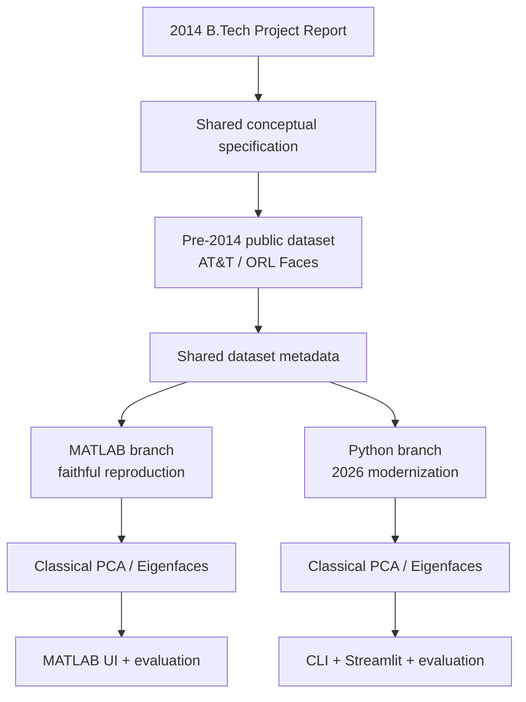
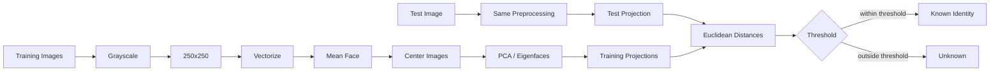

# Architecture

The repository intentionally has two implementation branches around a shared dataset definition.

## Core algorithm

Both branches implement the same conceptual sequence:

The Python branch changes the implementation machinery around this core rather than changing the algorithm into a deep-learning system.
